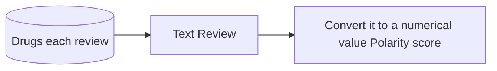
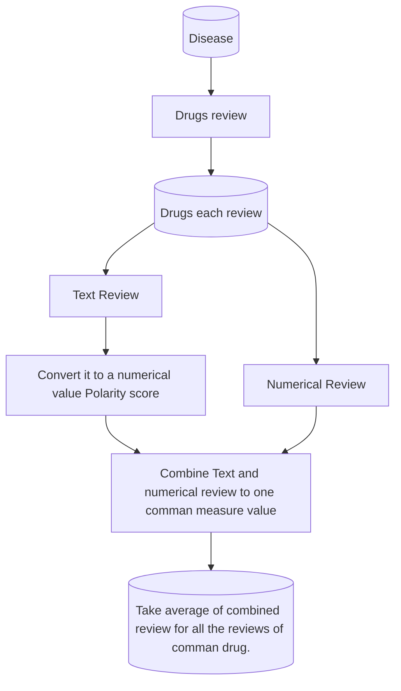

---
## Patient’s Condition Classification Using Drug Reviews
---

# EDA

---

###  Business Objective:

This is a sample dataset which consists of 161297 drug name, condition reviews and ratings from
different patients and our goal is to examine how patients are feeling using the drugs their positive
and negative experiences so that we can recommend him a suitable drug. By analyzing the reviews,
we can understand the drug effectiveness and its side effects.

---

The dataset provides patient reviews on specific drugs along with related conditions and a 10 star
patient rating reflecting overall patient satisfaction.
So in this dataset, we can see many patients conditions but we will focus only on the below, classify
the below conditions from the patients reviews
-  a. Depression
-  b. High Blood Pressure
-  c. Diabetes, Type 2

---

### Data Set Explanation

Attribute Information:

 1. DrugName (categorical): name of drug
 2. condition (categorical): name of condition
 3. review (text): patient review
 4. rating (numerical): 10 star patient rating
 5. date (date): date of review entry
 6. usefulCount (numerical): number of users who found review useful

---

<div class="mermaid">
flowchart TB;
    1[(Total data)] --> 2[Extract needed data] --> 3[(export extracted data as csv file)]
</div>


---

Total data set dimensions

```python
df.shape
```

We have total 161297 rows and 7 columns

~~~
(161297, 7)
~~~

---

Extracting the following diseases data: 

```python
df_proj = df_data.loc[df['condition'].isin(["Diabetes, Type 2",
"Diabetes, Type 1",
"Diabetic Peripheral Neuropathy",
"Diabetic Kidney Disease",
"Diabetes Insipidus",
"Diabetic Macular Edema",
"Gestational Diabetes",
"Depression",
"Postpartum Depression",
"Neurotic Depression",
"High Blood Pressure",
"Postoperative Increased Intraocular Pressure"
])]
```


---
Extracted data set dimensions

```python
df_proj.shape
```

We have total 161297 rows and 7 columns

~~~
(14386, 7)
~~~

---
#### Fortunately we don't have null values

Null values finding

```python
df_data['condition'].isnull().sum(axis = 0)
```

0 null values

~~~
0
~~~

---
Bar graph of count of ratings


---
 Word Cloud for all the reviews in the data set.

![[output_46_0.png]]

---
 Word cloud of the reviews with rating equal to 10

![[output_47_0.png]]

---
Word cloud of the reviews with rating equal to 1

![[output_48_0.png]]

---
This barplot shows the mean rating per year

![[output_49_0.png]]

---
This barplot show the top 10 conditions the people are suffering.

![[output_50_0.png]]

---

Top 10 Drugs for Depression

![[output_51_0.png]]

---
Top 10 Least useful Drugs for Depression based on ratings

![[output_52_0.png]]

---
Word cloud of reviews of Depression

![[output_53_0.png]]

---
Top 10 Drugs for Diabetes Type 2

![[output_54_0.png]]

---
Top 10 Least useful Drugs for Diabetes type 2 based on ratings

![[output_55_0.png]]

---
Word cloud of reviews of Diabetes Type 2 

![[output_56_0.png]]

---
Top 10 Drugs for High Blood Pressure

![[output_57_0.png]]

---
Top 10 Least useful Drugs for High Blood Pressure based on ratings

![[output_58_0.png]]

---
Word cloud of reviews of High Blood Pressure

![[output_59_0.png]]

---
Top 20 drugs with Maximum 10 ratings

![[output_40_0 1.png]]

---
Top 20 drugs with Maximum 1 ratings
![[output_41_0.png]]

---

![[output_60_1 1.png]]

---

![[output_61_0.png]]

---

![[output_62_0.png]]

---

![[output_69_0.png]]
---

![[output_65_0.png]]

---

![[output_66_0 1.png]]

---

![[output_67_0.png]]


---

![[output_93_0.png]]


---

### Business Objective:

This is a sample dataset which consists of 161297 drug name, condition reviews and ratings from different patients and ==**our goal is to examine how patients are feeling using the drugs their positive and negative experiences so that we can recommend him a suitable drug. By analyzing the reviews**==, we can understand the drug effectiveness and its side effects.

The dataset provides patient reviews on specific drugs along with related conditions and a 10 star patient rating reflecting overall patient satisfaction.

---
![[Pasted image 20230406184834.png]]


---

```python
 pol = []
    for i in review:
        analysis = TextBlob(i)
        pol.append(analysis.sentiment.polarity)
    return pol
```


![[Pasted image 20230406184521.png]]

---

So now assign each review  a polarity score value from -1 to 1 :  

- $$ -1 \rightarrow Most -ve \ review $$
- $$ 0 \rightarrow Neutral \ review  $$
- $$ 1 \rightarrow Most +ve \ review $$
---

Converting polarity score value from [ -1, 1 ] to [ 1,  10 ]  :

$$
(Polarity \ score) \times -5 + 6 = New \ changed \ polarity \ score.
$$

---

Converting the value close to 

- $$ 1 \rightarrow Most -ve \ review $$
- $$ 5 \rightarrow Neutral \ review  $$
- $$ 10 \rightarrow Most +ve \ review $$

---

Developing a new composite score which takes both rating and polarity score weight-age equally.

$$
\frac{rating + new \ changed \ polarity \ score}{2} = cumilative 
$$

---

Taking the average of composite score for command drugs and base on the disorder we rank the drugs which had the highest score as the best recommendation for the patient with the disorder. 

---

### Models 

 TF IDF Matrix 

![[Pasted image 20230407193021.png]]


---


### Models 
- Naives Bayes classifier 
- Passive aggressive classifier 


---

## Web app Drug Suggestion

---

```python
import streamlit as st
import pandas as pd
import numpy as np
# Load the dataframe from a pickle file
with open('df_app.pkl', 'rb') as f:
df = pd.read_pickle(f)
# Define the dropdown menu options
options = ['Depression', 'Type 2 Diabetes', 'High Blood Pressure']
# Define a function to display a different part of the dataframe based on the option selected
def display_dataframe(option, tail):
	if option == 'Depression':
	df_filtered = df[df['condition'] == 'Depression'].tail(tail).reset_index(drop=True)
	df_filtered.index += 1
	st.write(df_filtered)
	elif option == 'Type 2 Diabetes':
	df_filtered = df[df['condition'] == 'Diabetes, Type 2'].tail(tail).reset_index(drop=True)
	df_filtered.index += 1
	st.write(df_filtered)
	else:
	df_filtered = df[df['condition'] == 'High Blood Pressure'].tail(tail).reset_index(drop=True)
	df_filtered.index += 1
st.write(df_filtered)
# Create the Streamlit app
st.title('Best Drug Suggestion for Medical disorder ')
option = st.selectbox('Select a condition:', options)
tail = st.number_input('Enter the number of top drugs you want to know for the disorder:', min_value=1, max_value=len(df), value=5, step=1)
if st.button('Submit'):
display_dataframe(option, tail)
```

---

![[Pasted image 20230406182106.png]]

---

![[Pasted image 20230406182134.png]]

---

![[Pasted image 20230406182218.png]]

---

![[Pasted image 20230406182249.png]]

---

![[Pasted image 20230406182410.png]]

---

## Web app review drug suggestion

---

#### Code

```python
#"""
#This code builds a streamlit app which takes review as input and spits out the underlying conditon and top 5 drug Recommendation for the condition according with single submit.
#"""

import streamlit as st
import pickle
import pandas as pd

#Load the dataframe and model from a pickle file
with open('df_app.pkl', 'rb') as f:
    df = pd.read_pickle(f)

with open('model.pkl', 'rb') as f:
    pass_tf2, tfidf_vectorizer2 = pickle.load(f)

# Set the title
st.title("Matching Patients with Effective Medications")

# Set Header Title
st.header('**Welcome to our health prediction app!** :wave:')

# Set the description
st.markdown("""
Get quick and accurate results for your health condition with our app. Type in your review, click Submit, and let our advanced algorithms do the rest. We'll identify your underlying condition and provide you with the top 5 drugs for relief. Try it today and feel better :smile:.
""")

#create a text input for user input
#text_input = st.text_input('Type your review here')
text_input = st.text_area('Type your review here', height=100)

#create a submit button
submit_button = st.button('Submit')

# Input for the function
prediction = None
if submit_button and text_input:
    prediction = pass_tf2.predict(tfidf_vectorizer2.transform([text_input]))[0]
    st.write('Based on the review given this could be your underlying condition:', prediction)

option = prediction

#Define a function to display a different part of the dataframe based on the option selected
def display_dataframe(option):
    if option == 'Depression':
        df_filtered = df[df['condition'] == 'Depression'].tail(5).iloc[::-1].reset_index(drop=True)
        df_filtered.index += 1
        st.table(df_filtered)
    elif option == 'Type 2 Diabetes':
        df_filtered = df[df['condition'] == 'Diabetes, Type 2'].tail(5).iloc[::-1].reset_index(drop=True)
        df_filtered.index += 1
        st.table(df_filtered)
    else:
        df_filtered = df[df['condition'] == 'High Blood Pressure'].tail(5).iloc[::-1].reset_index(drop=True)
        df_filtered.index += 1
        st.table(df_filtered)

if prediction:
    display_dataframe(prediction)

```

---

![[Pasted image 20230407174347.png]]

---
![[Pasted image 20230407174424.png]]

---

![[Pasted image 20230406182249.png]]

---

![[Pasted image 20230407174510.png]]


---

---

## Team Members
- **Mr. Shreyash Patil**
- **Mr.Anish Chichad
- **Mr. Adesh Mahadev Jadhav
- **Mr. Abhijeet N Patil
- **Mr.Vempali Mani Ratnam
- **Miss Kavya d k 
- **Mrs. Jeyasree J K
- **Mr. Atit Naresh Dupare

---

# Thank You

---

---

---

---


---




---


<!-- Add Mermaid library to head section -->
<script src="https://cdn.jsdelivr.net/npm/mermaid/dist/mermaid.min.js"></script>
<script>mermaid.initialize({startOnLoad:true});</script>